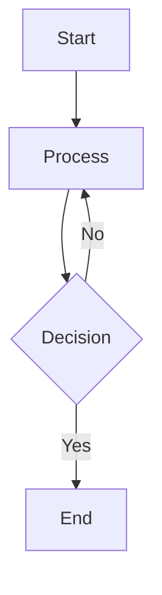

# Kopi Theme - Content Management Guide

Complete guide for creating and managing content in the Kopi theme.

## Table of Contents

- [Creating Posts](#creating-posts)
- [Front Matter](#front-matter)
- [Content Formatting](#content-formatting)
- [Managing Pages](#managing-pages)
- [Directory Structure](#directory-structure)

---

## Creating Posts

### Using Hugo Generator

```bash
hugo new content/section/post-title.md
```

Example:
```bash
hugo new content/blog/my-first-post.md
```

This creates a new file with the default archetype template.

### Manual Creation

Simply create a markdown file in your content directory with the required front matter.

---

## Front Matter

Every post requires front matter at the top of the file:

```yaml
---
title: "Your Post Title"
date: 2026-05-18T10:30:00Z
draft: false
tags: ["tag1", "tag2", "tag3"]
author: "Author Name"
description: "Short description for SEO"
---

Your content starts here...
```

### Required Fields

| Field | Type | Description |
|-------|------|-------------|
| `title` | string | Post title (displayed in listings and browser tab) |
| `date` | datetime | Publication date (ISO 8601 format with timezone) |

### Optional Fields

| Field | Type | Description |
|-------|------|-------------|
| `draft` | boolean | Set to `false` to publish (defaults to `true`) |
| `tags` | array | List of tags for organizing content |
| `author` | string | Single author name (must match author profile) |
| `authors` | array | Multiple authors: `["Author 1", "Author 2"]` |
| `description` | string | SEO description (80-160 characters) |
| `publishDate` | datetime | Schedule post to appear on specific date |
| `expiryDate` | datetime | Post automatically hidden after this date |
| `cover` | string | Featured image path (e.g., `/images/cover.png`) |

---

## Content Formatting

### Text Styling

```markdown
**Bold text**                    # Bold
*Italic text*                    # Italic
***Bold and italic***            # Both
`inline code`                    # Inline code
~~Strikethrough~~                # Strikethrough
```

### Headings

```markdown
# H1 - Page Title (use once per post)
## H2 - Section Heading
### H3 - Subsection
#### H4
##### H5
###### H6
```

### Lists

**Unordered:**
```markdown
- Item 1
- Item 2
  - Nested item
  - Another nested item
- Item 3
```

**Ordered:**
```markdown
1. First step
2. Second step
   1. Substep
3. Third step
```

### Code Blocks

**Inline code:**
```markdown
Use `const x = 5;` in your JavaScript
```

**Multi-line with syntax highlighting:**
````markdown
```python
def hello_world():
    print("Hello, World!")
```
````

Supported languages: `python`, `javascript`, `yaml`, `bash`, `html`, `css`, `json`, `go`, `rust`, `typescript`, `php`, `ruby`, and many more.

### Links

```markdown
[Link text](https://example.com)
[Internal link](/about/)
[Link with title](https://example.com "Hover text")
```

### Images

```markdown


```

Store images in: `static/images/`

### Tables

```markdown
| Header 1 | Header 2 | Header 3 |
|----------|----------|----------|
| Cell 1   | Cell 2   | Cell 3   |
| Cell 4   | Cell 5   | Cell 6   |
```

### Blockquotes

```markdown
> This is a blockquote
> It can span multiple lines
>
> With multiple paragraphs
```

### Horizontal Rules

```markdown
---
```

---

## Advanced Formatting

### Mermaid Diagrams

The theme supports Mermaid.js for creating diagrams:

````markdown

````

### Custom Markdown Extensions

The theme supports Hugo's custom markdown rendering through `render-codeblock.html` and `render-image.html`.

---

## Managing Pages

### Static Pages

Create pages in the root `content/` directory:

- `content/_index.md` - Homepage
- `content/about.md` - About page
- `content/search.md` - Search page

Edit these files directly to update page content.

### Adding New Sections

To create a new content section (e.g., tutorials, documentation):

```bash
mkdir -p content/tutorials
hugo new content/tutorials/_index.md
hugo new content/tutorials/tutorial-1.md
```

The `_index.md` file becomes the section landing page, and individual posts go in the same directory.

### Directory Structure

```
content/
├── _index.md              # Homepage
├── about.md               # About page
├── search.md              # Search page
├── infotainment/          # Section: Blog/News
│   ├── _index.md          # Section landing
│   ├── post-1.md          # Individual post
│   └── post-2.md
├── tutorials/             # Section: Tutorials
│   ├── _index.md
│   ├── tutorial-1.md
│   └── tutorial-2.md
└── authors/               # Author profiles
    ├── john-doe.md
    └── jane-smith.md
```

---

## Best Practices

1. **Use descriptive titles** - Clear, SEO-friendly titles help with discoverability
2. **Add descriptions** - Include meta descriptions for better SEO
3. **Tag consistently** - Use existing tags, create new ones as needed
4. **Include dates** - Always add publication dates with proper timezone
5. **Use proper headings** - Start with H2 (H1 is your title)
6. **Add author info** - Link posts to author profiles when available
7. **Keep drafts organized** - Use `draft: true` while working
8. **Proofread content** - Check for typos and formatting issues before publishing
9. **Optimize images** - Compress images before adding to reduce load times
10. **Use internal links** - Link to related posts to improve navigation

---

## Publishing Workflow

1. **Create the post** with `draft: true`
2. **Write content** and test locally with `hugo server`
3. **Review** in your browser for formatting issues
4. **Set `draft: false`** when ready to publish
5. **Commit and push** to trigger automatic deployment

---

## Next Steps

- [Setup Author Profiles](AUTHORS.md) - Add author information to posts
- [Development Guide](SETUP.md) - Configure and customize the theme
- [Contributing](../CONTRIBUTING.md) - Help improve the theme
